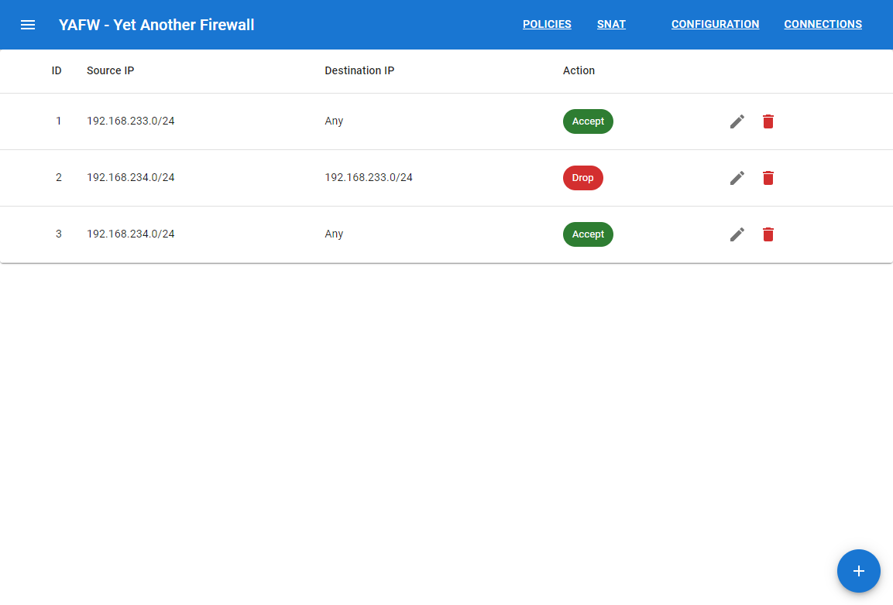
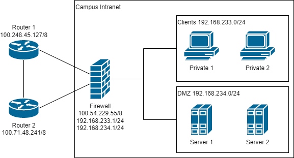

# yafw

Yet Another Firewall

## Features

*  [x] Based on state-of-the-art APIs from Linux `nftables`
*  [x] Easy-to-manage Security policies
*  [x] NAT Support
*  [x] Web UI
*  [ ] Zone-based security models



## Usage

```bash
make -B build
```

## Tests

Some unit tests are finished and can be launched through `make test_docker`.

An example topology test is shown below.



Servers are all running a simple PHP service. Correctness of the rules can be checked through `ping`, `traceroute`, `curl` etc. on some machines.
